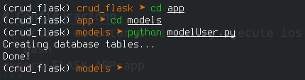

# Dependencias
### Pipenv: Flujo de trabajo en Python para humanos.
> Pipenv es una herramienta que apunta a traer todo lo mejor del mundo de empaquetado (bundler, composer, npm, cargo, yarn, etc.) al mundo de Python. Windows es un ciudadano primera-clase en nuestro mundo, para más información visite [pipenv](https://pypi.org/project/pipenv/).
```bash
 $ pip install pipenv
```
Ahora para instalar las dependencias siempre utilizamos:
```bash
    $ pipenv install flask
    $ pipenv install flask-sqlalchemy
    $ pipenv install flask-marshmallow
    $ pipenv install marshmallow-sqlalchemy
    $ pipenv install pymysql
    $ pipenv install
```
# Configuración
1. Active el entorno virtual y ejecute los comandos.
```bash
export FLASK_APP=app
```
2. Cambiamos a pipenv en la terminal.
```bash
    $ pipenv shell
```
3. Para ejecutar las migraciones, situarse en la carpeta models a traves de la terminal.
```bash
    $ cd app
    $ cd models
```
4. Ejecutar el archivo `modelsUser.py` en la terminal (ver el [archivo](app/models/modelUser.py) contiene información relevante).
```bash
    $ python modelsUser.py
```
El resultado al ejecutar las migraciones ser verá de la siguiente manera:


5. Finalmente solo ejecutar:
```bash
    $ flask run
```